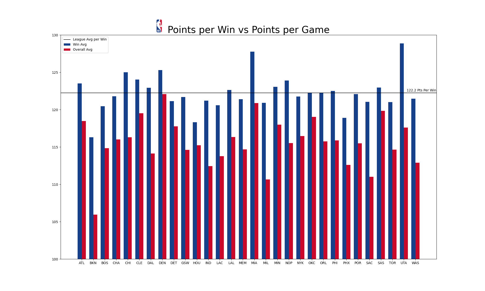

# 2025-26 Points per Win

## Introduction

The concept is simple, score the most points and you win the game. But when NBA teams win games, do they score more than their average or do some teams have to reduce thier offensive output and focus on other aspects of the game in order to win? If a team is really good, then the assumption is that they likely blow away most competition with high scoring basketball. Perhaps it may be the other around, poorer teams may need to cultivate more effort than normal to pull out a win. But is that method sustainable?

## Points per Win Vs Overall Average

The graph displays each repspective team's average points per win and there average points per game. There is a black horizontal line to represent the league-wide average points per win so it can be easier to analyze how teams perform against the average. At first glance, the Utah Jazz and the Miami Heat's average points per win stands out the most by being really high. In the case of the Utah Jazz, there overall average points per game is much further below their average points per win compared to the Miami Heat's averages. Another standout is how poor the Brooklyn Nets's average point per win is. Not only does the Nets have the worst average points per win, they also have the worst points per game overall. not even reaching 110 points per game. Both the Jazz and the Nets were one of the worst teams in the league in the 2025-26 NBA season.

