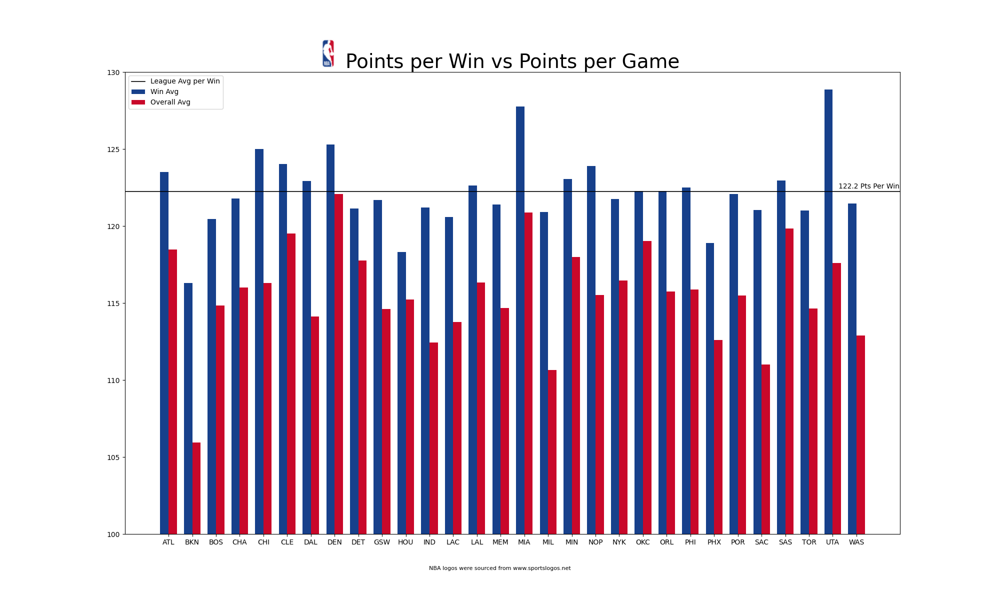
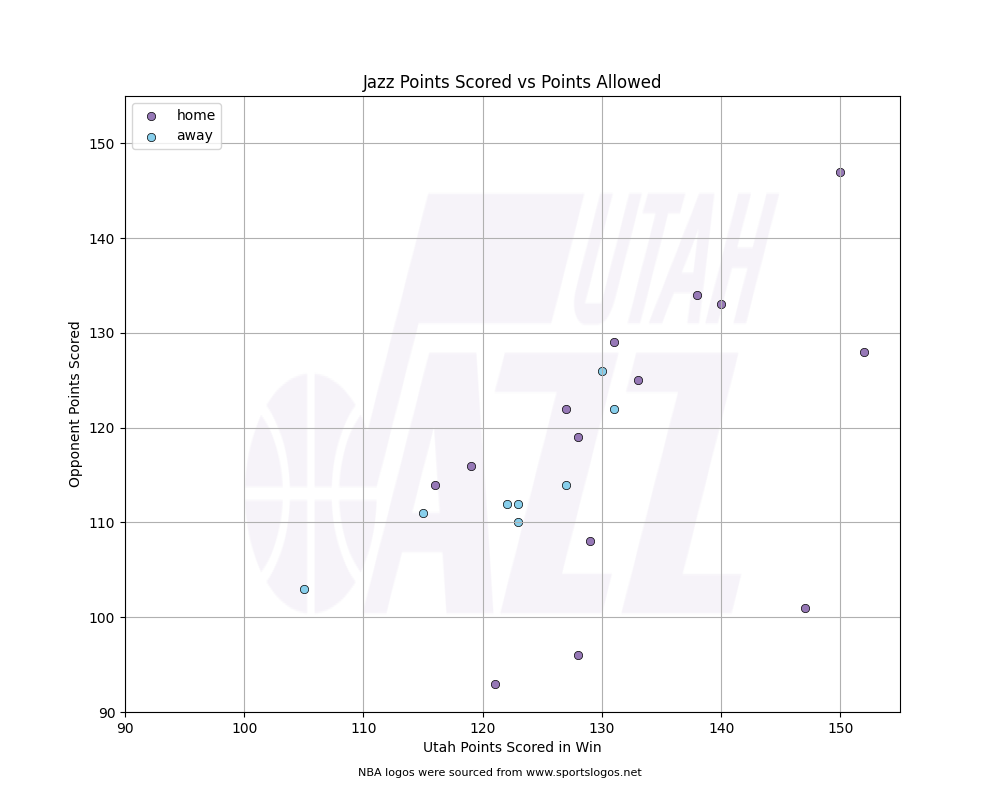
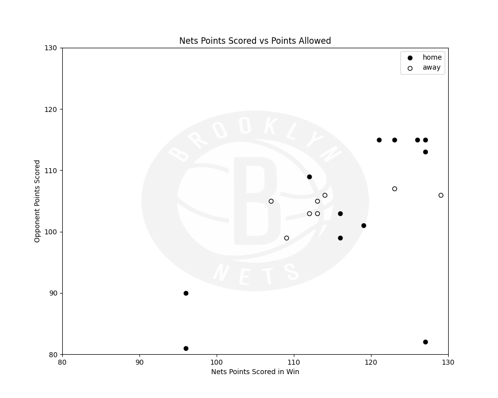
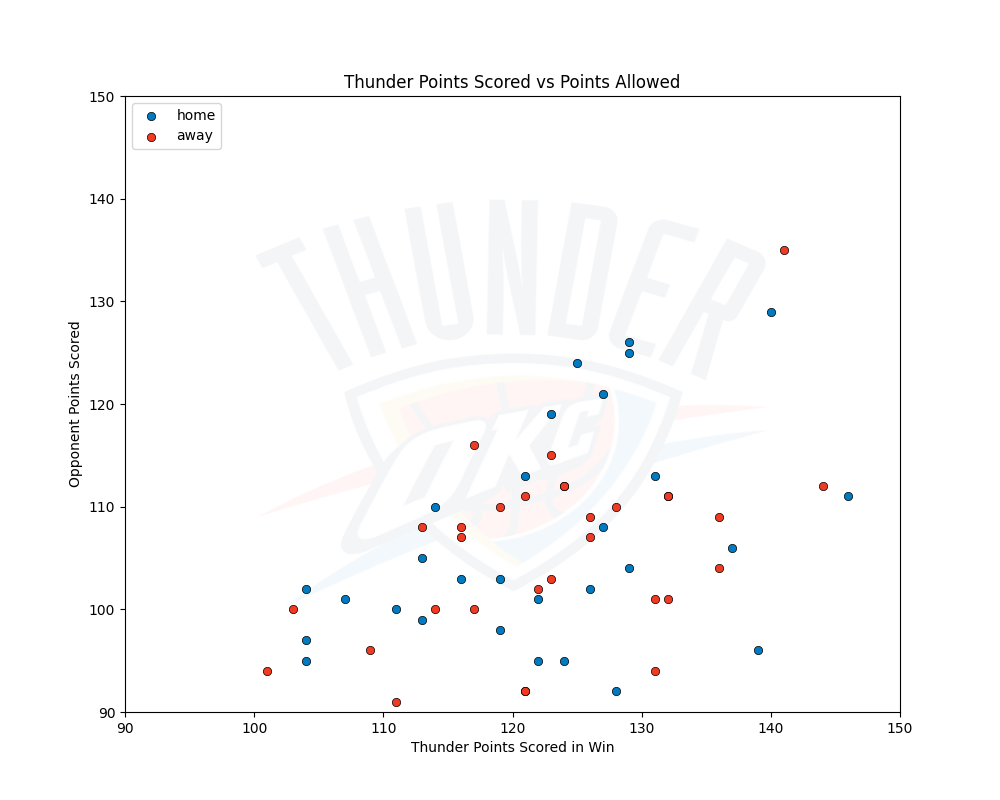
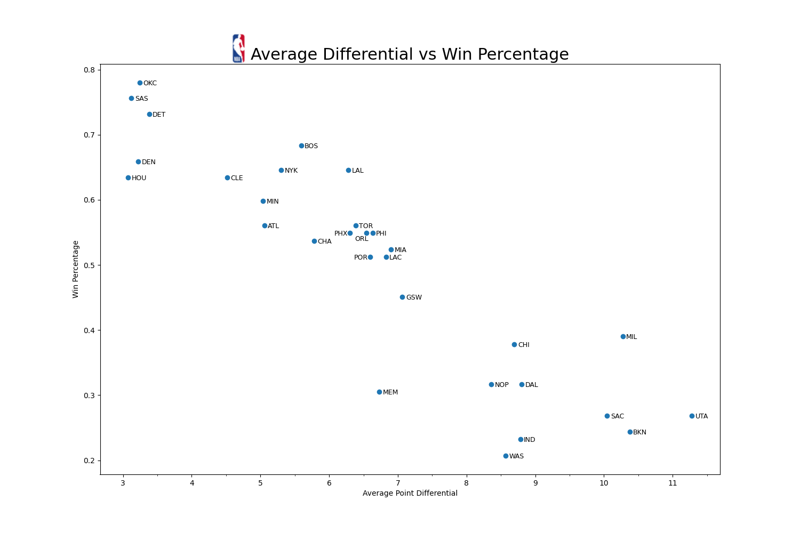

# 2025-26 Points per Win

## Introduction

The concept is simple, score the most points and you win the game. But when NBA teams win games, do they score more than their average or do some teams have to reduce thier offensive output and focus on other aspects of the game in order to win? If a team is really good, then the assumption is that they likely blow away most competition with high scoring basketball. Perhaps it may be the other around, poorer teams may need to cultivate more effort than normal to pull out a win. But is that method sustainable?

## Points per Win Vs Overall Average

The graph displays each repspective team's average points per win and there average points per game. There is a black horizontal line to represent the league-wide average points per win so it can be easier to analyze how teams perform against the average. At first glance, the Utah Jazz and the Miami Heat's average points per win stands out the most by being really high. In the case of the Utah Jazz, there overall average points per game is much further below their average points per win compared to the Miami Heat's averages. Another standout is how poor the Brooklyn Nets's average point per win is. Not only does the Nets have the worst average points per win, they also have the worst points per game overall. not even reaching 110 points per game. Both the Jazz and the Nets were one of the worst teams in the league in the 2025-26 NBA season.

## Utah's Win Performance

The Utah Jazz didn't win often throughout the season. But out of the games the Jazz won, there were several games where both teams scored very high. This indicates that the Jazz tended to sacrafice defense in order to produce high-scoring offense to win. This is likely the reason why the Jazz averaged the highest points per win (128.9 per game) in the league and why their win average and overall average had the largest difference in the league (11.3 points). It's not sustainable to maintain such a high offensive output for an entire season, which is likely why the Jazz had a poor win percentage.

## Brooklyn's Win Performance

The Brooklyn Nets had the second highest point differential between points per win and overall points per game (10.4 points). Although the Nets find a way to produce a personal higher than normal offensive efficiency, they averaged the lowest points per win average (116.3 points) and had the leagues worst overall points per game average (105.9). The Nets were the only team to average less than 110 points per game. The Nets' peak offense couldn't rival the league's elite, as their average points per win lagged behind a third of the NBA. Altought victories were sparse, the Nets were able to make up for their lack of offensive output with their defensive performance. In one of their best defensive performace, the Nets managed to smother their opponents with holding them to less than 90 points while scoring an uncharacteristically high 127 points. Unfortunately, the Nets could not make strong defense a regular occurance. They ended the season with only 20 wins, third worst in the league.

## Point Average Differentials vs Win Percentage

### OKC's Win Performance

